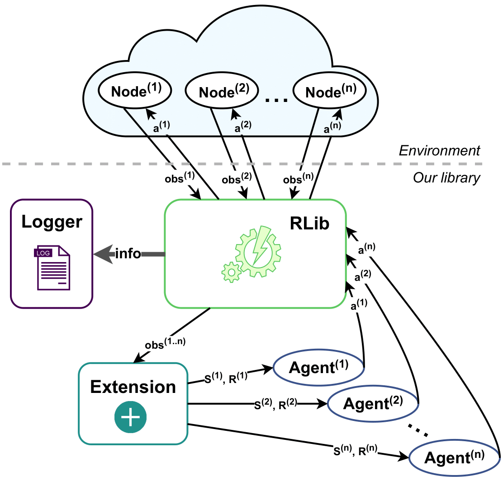

# Reinforced-lib: Reinforcement learning library

[![PyPI version][pypi-badge]][pypi]
[![License: MPL 2.0][license-badge]][license]
[![build and test][tests-badge]][github-actions]
[![Documentation Status][rtd-badge]][documentation]

[pypi-badge]: https://img.shields.io/pypi/v/reinforced-lib
[pypi]: https://pypi.org/project/reinforced-lib/
[license-badge]: https://img.shields.io/badge/License-MPL%202.0-brightgreen.svg
[license]: https://opensource.org/licenses/MPL-2.0
[tests-badge]: https://github.com/m-wojnar/reinforced-lib/actions/workflows/python-package.yml/badge.svg
[github-actions]: https://github.com/m-wojnar/reinforced-lib/actions
[rtd-badge]: https://readthedocs.org/projects/reinforced-lib/badge/?version=latest
[documentation]: https://reinforced-lib.readthedocs.io/en/latest/

**Introducing Reinforced-lib:** a lightweight Python library for rapid development of RL solutions. It is open-source, 
prioritizes ease of use, provides comprehensive documentation, and offers both deep reinforcement learning 
(DRL) and classic non-neural agents. Built on [JAX](https://jax.readthedocs.io/en/latest/), it facilitates exporting 
trained models to embedded devices, and makes it great for research and prototyping with RL algorithms. Access to JAX's 
JIT functionality ensure high-performance results.

## Installation

You can install the latest released version of Reinforced-lib from PyPI via:

```bash
pip install reinforced-lib
```

To have an easy access to the [example files](https://github.com/m-wojnar/reinforced-lib/tree/main/examples)
you can clone the source code from our repository, and than install it locally with pip:

```bash
git clone git@github.com:m-wojnar/reinforced-lib.git
cd reinforced-lib
pip install .
```

In the spirit of making Reinforced-lib a lightweight solution, we included only the necessary dependencies in the base 
requirements. To fully benefit from Reinforced-lib conveniences, like TF Lite export, install with the "full" suffix:

```bash
pip3 install ".[full]"
```

## Key components

Reinforced-lib facilitates seamless interaction between RL agents and the environment. Here are the key components 
within of the library, represented in the API as different modules.

- **RLib** - The core module which provides a simple and intuitive interface to manage agents, use extensions, 
  and configure the logging system. Even if you're not a reinforcement learning (RL) expert, *RLib* makes it easy to 
  implement the agent-environment interaction loop.

- **Agents** - Choose from a variety of RL agents available in the *Agents* module. These agents are designed to be 
  versatile and work with any environment. If needed, you can even create your own agents using our documented recipes.

- **Extensions** - Enhance agent observations with domain-specific knowledge by adding a suitable extension from the 
  *Extensions* module. This module enables seamless agent switching and parameter tuning without extensive reconfiguration.

- **Logging** - This module allows you to monitor agent-environment interactions. Customize and adapt logging to your 
  specific needs, capturing training metrics, internal agent state, or environment observations. The library includes 
  various loggers for creating plots and output files, simplifying visualization and data processing.

The figure below provides a visual representation of Reinforced-lib and the data-flow between its modules.



## JAX Backend

Our library is built on top of JAX, a high-performance numerical computing library. JAX makes it easy to implement 
RL algorithms efficiently. It provides powerful transformations, including JIT compilation,  automatic differentiation, 
vectorization, and parallelization. Our library is fully compatible with DeepMind's JAX ecosystem, granting access to 
state-of-the-art RL models and helper libraries. JIT compilation significantly accelerates execution and ensures 
portability across different architectures (CPUs, GPUs, TPUs) without requiring code modifications.

## Edge Device Export

Reinforced-lib is designed to work seamlessly on wireless, low-powered devices, where resources are limited. It's the 
perfect solution for energy-constrained environments that may struggle with other ML frameworks. You can export your 
trained models to [TensorFlow Lite](https://www.tensorflow.org/lite) with ease, reducing runtime overhead and 
optimizing performance. This means you can deploy RL agents on resource-limited devices efficiently.

## Example code

Experience the simplicity of our library and witness the fundamental agent-environment interaction loop with our 
straightforward example. This code can by used to train a deep Q-learning agent on the `CartPole-v1` environment 
effortlessly using Reinforced-lib.

```python
import gymnasium as gym
import haiku as hk
import optax
from chex import Array

from reinforced_lib import RLib
from reinforced_lib.agents.deep import QLearning
from reinforced_lib.exts import Gymnasium


@hk.transform_with_state
def q_network(x: Array) -> Array:
    return hk.nets.MLP([256, 2])(x)


if __name__ == '__main__':
    rl = RLib(
        agent_type=QLearning,
        agent_params={
            'q_network': q_network,
            'optimizer': optax.rmsprop(3e-4, decay=0.95, eps=1e-2),
        },
        ext_type=Gymnasium,
        ext_params={'env_id': 'CartPole-v1'}
    )

    for epoch in range(300):
        env = gym.make('CartPole-v1', render_mode='human')

        _, _ = env.reset()
        action = env.action_space.sample()
        terminal = False

        while not terminal:
            env_state = env.step(action.item())
            action = rl.sample(*env_state)
            terminal = env_state[2] or env_state[3]
```

## Citing Reinforced-lib

To cite this repository:

```
@software{reinforcedlib2022,
  author = {Maksymilian Wojnar and Wojciech Ciężobka},
  title = {{R}einforced-lib: {R}einforcement learning library},
  url = {http://github.com/m-wojnar/reinforced-lib},
  year = {2022},
}
```
