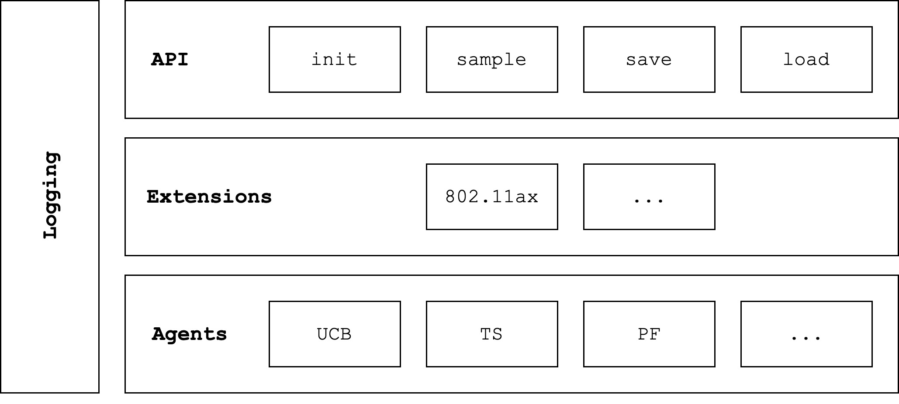

# Reinforced-lib: Reinforcement learning library

[![build and test][tests-badge]][github-actions]
[![Documentation Status][rtd-badge]][documentation]
[![PyPI version][pypi-badge]][pypi]
[](https://opensource.org/licenses/MPL-2.0)

[tests-badge]: https://github.com/m-wojnar/reinforced-lib/actions/workflows/python-package.yml/badge.svg
[github-actions]: https://github.com/m-wojnar/reinforced-lib/actions
[rtd-badge]: https://readthedocs.org/projects/reinforced-lib/badge/?version=latest
[documentation]: https://reinforced-lib.readthedocs.io/en/latest/
[pypi-badge]: https://img.shields.io/pypi/v/reinforced-lib
[pypi]: https://pypi.org/project/reinforced-lib/

## Overview

**Reinforced-lib** is a Python library designed to support research and prototyping using reinforcement learning
(RL) algorithms. The library can serve as a simple solution with ready to use RL workflows as well as
an expandable framework with programmable behaviour. Thanks to the functional implementation of the library's core,
we can provide full access to JAX's jit functionality, which boosts the agent's performance significantly.

## Installation

You can install the latest released version of Reinforced-lib from PyPI via:

```bash
pip install reinforced-lib
```

You can also download source code and install the development dependencies if you want to build the documentation locally:

```bash
git clone git@github.com:m-wojnar/reinforced-lib.git
cd reinforced-lib
pip3 install ".[dev]"
```

## Example code

```python
from reinforced_lib import RLib
from reinforced_lib.agents.mab import ThompsonSampling
from reinforced_lib.exts.wifi import IEEE_802_11_ax_RA

import gymnasium as gym

rlib = RLib(
    agent_type=ThompsonSampling,
    ext_type=IEEE_802_11_ax_RA
)

env = gym.make('WifiSimulator-v1')
env_state, _ = env.reset()

terminal = False
while not terminal:
    action = rlib.sample(**env_state)
    env_state, reward, terminal, *_ = env.step(action)
```

## Integrated IEEE 802.11ax support

The library's design is distinctly influenced by the desire to support research in Wi-Fi. It can be a tool for researchers 
to optimize Wi-Fi protocols with built-in RL algorithms and provided the IEEE 802.11ax environment extension.

We also provide simple [ns-3](https://www.nsnam.org/) simulation and RL-based rate adaptation manager for the 
IEEE 802.11ax standard in [examples](https://github.com/m-wojnar/reinforced-lib/tree/main/examples/ns-3).

## Modular architecture

**Reinforced-lib** can be well characterized by its modular architecture which makes the library flexible, universal,
and easy-to-use. Its key parts are placed in separate modules and connected in a standardized way to provide versatility
and the possibility to extend individual modules in the future. Nevertheless, Reinforced-lib is a single piece of software
that can be easily used, thanks to the topmost module, which ensures a simple and common interface for all agents.



### The API module

The API module is the top layer of the library; it exposes a simple and intuitive interface that makes the library easy
to use. There are several important methods, one of them is responsible for creating a new agent. Another takes the
observations from the environment as input, updates the state of the agent, and returns the next action proposed by the agent.
The last two methods are used to persist the state of the agent by storing it in memory.

### The extensions module

The extensions module consists of containers with domain-specific knowledge and ensures the proper use of universal agents
implemented in **Reinforced-lib**. If a specific problem is implemented in the form of an extension, the module infers and
provides the appropriate data to the agent, and at the same time requires adequate, corresponding values from the user.

### The agents module

The agents module is a collection of universal algorithms, which are called "agents" in the RL community. Each agent has
a similar API to communicate with the Extensions module, which ensures its versatility and expandability. In this release
of **Reinforced-lib**, we focus on the [multi-armed bandit problem](https://en.wikipedia.org/wiki/Multi-armed_bandit),
hence the implemented agents are related to this task.

### The logging module

The logging module is responsible for collecting data from other modules and observing their state in real time.
It also has great potential in using the library to create new RL agents - it can be used to develop, evaluate,
and debug new agents by observing decisions they make; record and visualize how environment state changes in time;
or provide a simple way to obtain a training summary, metrics, and logs.

## Citing Reinforced-lib

To cite this repository:

```
@software{reinforcedlib2022,
  author = {Maksymilian Wojnar and Wojciech Ciężobka},
  title = {{R}einforced-lib: {R}einforcement learning library},
  url = {http://github.com/m-wojnar/reinforced-lib},
  year = {2022},
}
```
