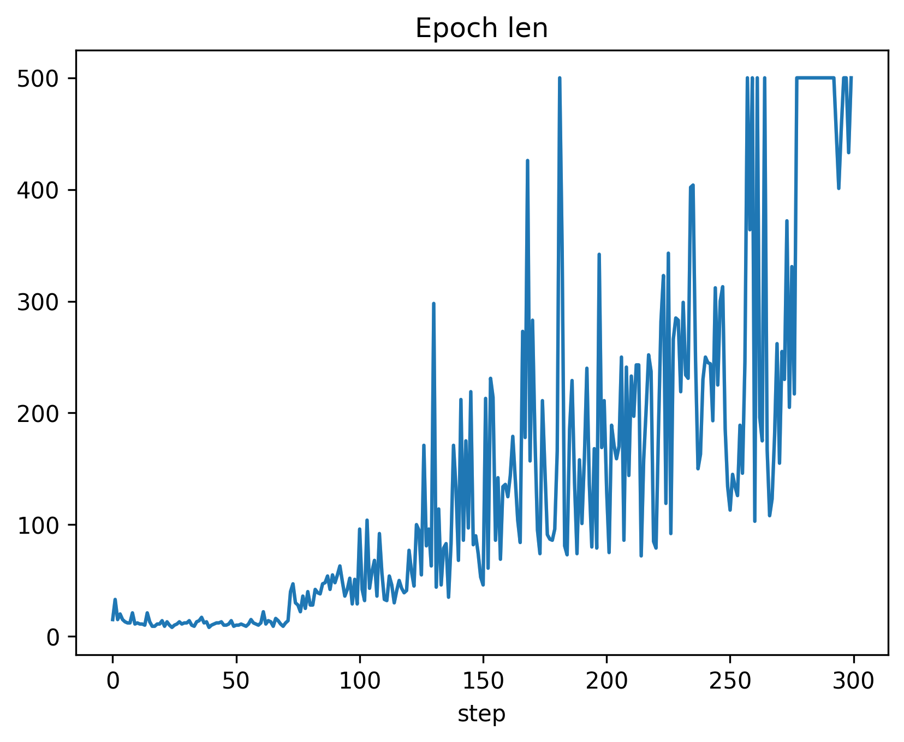
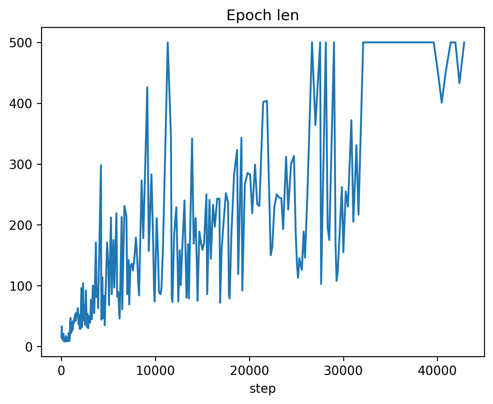

.. _custom_loggers:

Custom loggers
==============

Loggers serve as valuable tools for visualizing and analyzing algorithms in real-time during the training process.
They enable users to monitor observations passed to the agent, the agent's state, and basic metrics.

Key concepts of loggers
-----------------------

A basic concept of loggers is the "source". Sources are objects that can be logged. There are three types of sources:

- **observation** - value passed to the agent, such as the current state of the environment,
- **state** - value that is stored in the agent, for example, the array of Q-values,
- **metric** - value that is calculated during the training process, such as the cumulative reward.

Sources are represented by a string or a tuple ``(str, SourceType)``, where ``str`` is a name of the source,
and ``SourceType`` is an enum that specifies the type of the source. The enum has the following values:

- ``SourceType.OBSERVATION`` - the source is an observation passed to the agent,
- ``SourceType.STATE`` - the source is the agent's state,
- ``SourceType.METRIC`` - the source is a metric.

When creating an instance of the ``RLib`` class, users can specify the sources using the ``logger_sources`` parameter.
For example:

.. code-block:: python

    rl = RLib(
        agent_type=EGreedy,
        agent_params={'e': 0.25},
        ext_type=RecommenderSystemExt,
        logger_types=PlotsLogger,
        logger_sources=[('action', SourceType.METRIC), ('cumulative', SourceType.METRIC)]
    )

The above example demonstrates a logger of type ``PlotsLogger`` with two sources: ``action`` (representing the
last action taken by the agent) and ``cumulative`` (representing the cumulative reward). These values will be
logged each time the agent takes an action and receives a reward.

Users can use multiple loggers simultaneously by specifying a list of logger types in the ``logger_types``
parameter. For instance:

.. code-block:: python

    rl = RLib(
        ...
        logger_types=[PlotsLogger, CsvLogger, TensorboardLogger],
        logger_sources='cumulative'
    )

In this example, three loggers (``PlotsLogger``, ``CsvLogger``, and ``TensorboardLogger``) are used, each logging
the cumulative reward.

It is also possible to mix different types of loggers. To do this, the user should specify a list of sources
of the same length as the list of loggers. Each source will be logged by the corresponding logger. For example:

.. code-block:: python

    rl = RLib(
        ...
        logger_types=[PlotsLogger, CsvLogger, TensorboardLogger],
        logger_sources=[('action', SourceType.METRIC), 'cumulative', 'Q']
    )

Users are not restricted to predefined sources and can log any value using the ``log`` method of the ``RLib`` class.
The ``log`` method takes two parameters: ``name`` and ``value``. The example below shows how to log a value from a
custom source:

.. code-block:: python

    rl = RLib(
        ...
        logger_types=[TensorboardLogger, StdoutLogger]
    )

    for _ in range(epochs):
        ...
        rl.log('Epoch len', epoch_len)

Note that the ``log`` method does not take the ``SourceType`` parameter. In the provided example, all loggers
will log all the custom values passed to the ``log`` method. To log both predefined and custom values, set the
``logger_source`` as ``None`` for the desired logger, like this:

.. code-block:: python

    rl = RLib(
        ...
        logger_types=[StdoutLogger, PlotsLogger],
        logger_sources=[None, 'cumulative']
    )

In this example, the ``StdoutLogger`` will log all values passed to the ``log`` method, while the ``PlotsLogger``
will log only the cumulative reward.

Loggers can be used to log values of different types. The base interface of loggers provides the following methods:

- ``log_scalar`` - logs a scalar value,
- ``log_array`` - logs an one-dimensional array,
- ``log_dict`` - logs a dictionary,
- ``log_other`` - logs a value of any other type.

The ``LogsObserver`` :ref:`class <LogsObserver>` is responsible for selecting the appropriate method of the logger
for a given value based on its type.

Loggers can take a variety of parameters. The user can specify these parameters while creating an instance of
the ``RLib`` class by using the ``logger_params`` parameter. Note that the parameters are passed to instances of
all loggers listed in ``logger_type``, so the user should choose appropriate parameter names not to interfere
with other loggers.

One of the important concepts of loggers is the synchronization of the logged values. It is important when some
values are logged more often than others. Different loggers handle the synchronization in different ways. Below
you can find an illustrative example of the synchronization with the ``PlotsLogger``:

The first image depicts the plot of epoch length without synchronization, where the value is logged 300 times (once
per epoch). In contrast, the second plot shows the same value logged more than 40,000 times (once per step) with
synchronization.

Implementing new loggers
------------------------

To create your own logger, you should inherit from the :ref:`abstract class <BaseLogger>` ``BaseLogger``.
We will present creating a custom logger on the example of the ``CsvLogger`` :ref:`logger <CsvLogger>`:

.. code-block:: python

    class CsvLogger(BaseLogger)

To begin, we need to create a constructor for the loggers. The ``__init__`` function is capable of accepting various
arguments, which can be later provided through the ``logger_params`` parameter within the ``RLib`` :ref:`class <RLib
class>` constructor. Always ensure to include ``**kwargs`` in the arguments list to disregard parameters used by other
loggers. It is crucial to choose appropriate parameter names, considering they will be passed to instances of all
loggers mentioned in ``logger_type``. For instance, constructor parameters of ``PlotsLogger`` should with the
prefix ``plots_*``, while parameters of ``CsvLogger`` start with ``csv_*``. Below, you'll find an example constructor
of `CsvLogger`:

.. code-block:: python

    def __init__(self, csv_path: str = None, **kwargs) -> None:
        super().__init__(**kwargs)

        if csv_path is None:
            csv_path = f'rlib-logs-{timestamp()}.csv'
            csv_path = os.path.join(os.path.expanduser("~"), csv_path)

        self._csv_path = csv_path
        self._current_values = set()
        self._step = 0

        self._values = defaultdict(list)
        self._steps = defaultdict(list)

The essential logger methods consist of several functions serving the purpose of logging scalar values, arrays,
dictionaries, and other objects. Handling the transmission of logged values to the corresponding methods is the
responsibility of the ``LogsObserver`` :ref:`class <LogsObserver>`. To enable our logger to record values of a
specific type, we must override the appropriate methods. For instance, let us examine the ``log_scalar`` and
``log_other`` methods of ``CsvLogger``:

.. code-block:: python

    def log_scalar(self, source: Source, value: Scalar, *_) -> None:
        self._log(source, value)

    def log_other(self, source: Source, value: Any, *_) -> None:
        self._log(source, f"\"{json.dumps(value)}\"")

    def _log(self, source: Source, value: any) -> None:
        name = self.source_to_name(source)

        if name in self._current_values:
            self._step += 1
            self._current_values.clear()

        self._current_values.add(name)
        self._values[name].append(value)
        self._steps[name].append(self._step)

These are simple methods that log scalars and values of other types. The ``log_scalar`` function just takes the
raw scalar and saves it with a method ``_log`` of ``CsvLogger``. Similarly, the ``log_other`` function
converts a given value to the JSON format and then calls ``_log``. The ``_log`` method saves the value to the
``_values`` dictionary and controls the ``_step`` variable. The ``_step`` variable is used to determine the
current step of the logged value.

Note the use of the ``source_to_name`` method of ``BaseLogger`` that converts that source to a string.
If the source is a string (just a name of an observation, state, or metric), the method returns that string.
Otherwise, if the source is a tuple ``(str, SourceType)``, the function returns string ``"[name]-[source type name]"``.

If the logger is not able to log a value of some type (for example, it could be hard to plot a dictionary or a custom
object), we do not have to implement the corresponding ``log_*`` method. If the user tries to log a value of that
type with this logger, the library will raise the ``UnsupportedLogTypeError`` :ref:`exception <Exceptions>`.

``BaseLogger`` provides the ability to customize the initialization process by overwriting the ``init`` method,
which takes a list of predefined sources for the logger. Additionally, there is another useful method, ``finish``,
which allows you to perform actions such as saving data, closing files, displaying plots, or carrying out cleanup
tasks. This method is automatically triggered when an instance of the ``RLib`` class is deleted. Alternatively,
you can manually trigger the finalization by calling ``rl.finish()``. ``CsvLogger`` uses the ``finish``
method to save the logged data to a CSV file:

.. code-block:: python

    def finish(self) -> None:
        file = open(self._csv_path, 'w')
        file.write(','.join(self._values.keys()) + '\n')

        rows, cols = self._step + 1, len(self._values)
        csv_array = np.full((rows, cols), fill_value='', dtype=object)

        for j, (name, values) in enumerate(self._values.items()):
            for i, v in enumerate(values):
                csv_array[self._steps[name][i], j] = v

        for row in csv_array:
            file.write(','.join(map(str, row)) + '\n')

        file.close()

Template logger
---------------

Here is the above code in one piece. You can copy-paste it and use it as an inspiration to create your own logger.
The full source code of the ``CsvLogger`` can be found `here <https://github.com/m-wojnar/reinforced-lib/blob/main/reinforced_lib/logs/csv_logger.py>`_.

.. code-block:: python

    import json
    import os.path
    from collections import defaultdict

    import jax.numpy as jnp
    import numpy as np
    from chex import Array, Scalar

    from reinforced_lib.logs import BaseLogger, Source
    from reinforced_lib.utils import timestamp

    class CsvLogger(BaseLogger):
        def __init__(self, csv_path: str = None, **kwargs) -> None:
            super().__init__(**kwargs)

            if csv_path is None:
                csv_path = f'rlib-logs-{timestamp()}.csv'
                csv_path = os.path.join(os.path.expanduser("~"), csv_path)

            self._csv_path = csv_path
            self._current_values = set()
            self._step = 0

            self._values = defaultdict(list)
            self._steps = defaultdict(list)

        def finish(self) -> None:
            file = open(self._csv_path, 'w')
            file.write(','.join(self._values.keys()) + '\n')

            rows, cols = self._step + 1, len(self._values)
            csv_array = np.full((rows, cols), fill_value='', dtype=object)

            for j, (name, values) in enumerate(self._values.items()):
                for i, v in enumerate(values):
                    csv_array[self._steps[name][i], j] = v

            for row in csv_array:
                file.write(','.join(map(str, row)) + '\n')

            file.close()

        def log_scalar(self, source: Source, value: Scalar, *_) -> None:
            self._log(source, value)

        def log_array(self, source: Source, value: Array, *_) -> None:
            if isinstance(value, (np.ndarray, jnp.ndarray)):
                value = value.tolist()

            self._log(source, f"\"{json.dumps(value)}\"")

        def log_dict(self, source: Source, value: dict, *_) -> None:
            self._log(source, f"\"{json.dumps(value)}\"")

        def log_other(self, source: Source, value: any, *_) -> None:
            self._log(source, f"\"{json.dumps(value)}\"")

        def _log(self, source: Source, value: any) -> None:
            name = self.source_to_name(source)

            if name in self._current_values:
                self._step += 1
                self._current_values.clear()

            self._current_values.add(name)
            self._values[name].append(value)
            self._steps[name].append(self._step)
