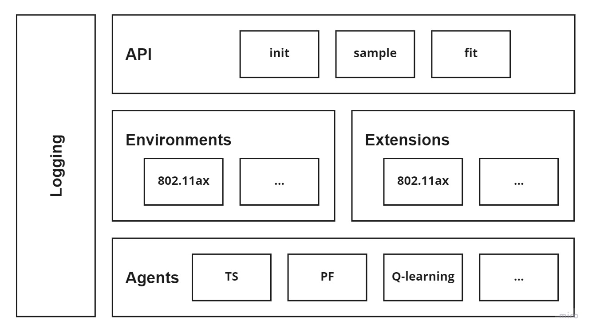

Getting started
===============

Installation
------------

You can clone source code from our repository:

.. code-block:: bash

    git clone git@github.com:m-wojnar/reinforced-lib.git

And install it with the pip3:

.. code-block:: bash

    cd reinforced-lib
    pip3 install .

You can also install the development dependencies if you want to build the documentation locally:

.. code-block:: bash

    cd reinforced-lib
    pip3 install ".[dev]"

Basic usage
-----------

The vital interface of  :ref:`Reinforced-lib <reinforced-lib>` is the :ref:`class <RLib Class>` ``Rlib``,
which abstracts the agent-environment interaction. In basic use case, you only need to provide an appropriate agent
with an environment extension related to your problem domain and the library will take care of the rest.

.. code-block:: python

    import gym

    import reinforced_lib as rfl
    from reinforced_lib.agents import ThompsonSampling
    from reinforced_lib.exts import IEEE_802_11_ax

    rlib = rfl.RLib(
        agent_type=ThompsonSampling,
        ext_type=IEEE_802_11_ax
    )

    env = gym.make('WifiSimulator-v1')

    state = env.reset()
    done = False

    while not done:
        action = rlib.sample(**state)
        state, reward, done, info = env.step(action)

Logging
-------

The logging module provides a simple and powerful API for visualizing and analyzing running algorithm or watching
the training process. You can monitor observations passed to the agent, the agents state, and basic metrics in
real time. Below is the simplest example of using the built-in logger ``StdoutLogger``:

.. code-block:: python

    rlib = rfl.RLib(
        agent_type=ThompsonSampling,
        ext_type=IEEE_802_11_ax,
        logger_type=StdoutLogger,
        loggers_sources='n_successful'
    )

You can easily change the logger type, add more sources, and customize parameters of the logger:

.. code-block:: python

    rlib = rfl.RLib(
        agent_type=ThompsonSampling,
        ext_type=IEEE_802_11_ax,
        logger_type=PlotsLogger,
        loggers_sources=['n_successful', 'alpha', ('action', SourceType.METRIC)],
        loggers_params={'plots_smoothing': 0.9}
    )

Note that ``n_successful`` is the observation name, ``alpha`` is name of the attribute of the ``ThompsonSampling``
agent, and ``action`` is the name of the metric. You can mix sources names as long as it does not lead to the
inconclusiveness. In the example above, it can be seen that ``action`` is both name of the observation and the metric.
In this case you have to write source name as the tuple containing name and type of the source ``(str, SourceType)``
as in the code above.

You can also plug multiple loggers to one source:

.. code-block:: python

    rlib = rfl.RLib(
        agent_type=ThompsonSampling,
        ext_type=IEEE_802_11_ax,
        logger_type=[StdoutLogger, CsvLogger, PlotsLogger],
        loggers_sources='n_successful'
    )

Or mix different loggers and sources:

.. code-block:: python

    rlib = rfl.RLib(
        agent_type=ThompsonSampling,
        ext_type=IEEE_802_11_ax,
        logger_type=[StdoutLogger, CsvLogger, PlotsLogger],
        loggers_sources=['n_successful', 'alpha', ('action', SourceType.METRIC)]
    )

In this case remember to provide a list of loggers that is the same length as a list of sources, because given loggers
will be used to log values for consecutive sources.

Saving experiments
------------------

``RLib`` :ref:`class <RLib Class>` provides an API for saving your experiment in a compressed ``.lz4`` format.
You can later reconstruct the experiment state and continue from the exact point where you have ended or you can
alter some training parameters during the reloading process.

Full reconstruction
~~~~~~~~~~~~~~~~~~~

We can imagine a scenario, where we set up the experiment, perform a little training, and then we need to make a break,
so we save the experiment at some state that we would later want to carry on from. When we are ready to continue with
the training, we can load the whole experiment to a new RLib instance.

.. code-block:: python

    import reinforced_lib as rfl

    from reinforced_lib.agents import ThompsonSampling
    from reinforced_lib.exts import IEEE_802_11_ax
    
    # Setting up the experiment
    rl = rfl.RLib(
        agent_type=ThompsonSampling,
        ext_type=IEEE_802_11_ax
    )

    # Do some training
    # ...

    # Saving experiment state for later
    rl.save("<checkpoint-path>")

    # Do some other staff, quit the script if you want.

    # Load the saved training
    rl = RLib.load("<checkpoint-path>")

    # Continue the training
    # ...

Dynamic parameters change
~~~~~~~~~~~~~~~~~~~~~~~~~

Another feature of this saving mechanism is that it allows us to dynamically change training parameters.
Let's recall the above example and modify it a little. We now want to modify on-the-run the ``decay``
parameter (responsible for the 'memory' of the thompson sampling agent).

.. code-block:: python

    import reinforced_lib as rfl

    from reinforced_lib.agents import ThompsonSampling
    from reinforced_lib.exts import IEEE_802_11_ax
    
    # Setting up the experiment
    rl = rfl.RLib(
        agent_type=ThompsonSampling,
        ext_type=IEEE_802_11_ax
    )

    # Do some training
    # ...

    # Saving experiment state for later
    rl.save("<checkpoint-path>")

    # Load the saved training with altered parameters
    rl = RLib.load("<checkpoint-path>", agent_params={"decay": new_decay})

    # Continue the training with new parameters
    # ...

You can change as many parameters we want. The provided example is constrained only to the agent
parameters alteration, but you can modify extension parameters in the same way. You can even control the
the loggers behaviour with the flag ``restore_loggers`` (more on loggers in the :ref:`Logging module <Logging module>`
section).

Modular architecture
--------------------

The whole library has a modular architecture, which makes it a flexible, universal, and easy-to-use. Key parts of
the library are placed in separate modules and connected in a standardized way to provide versatility and the
possibility to extend individual modules in the future.

